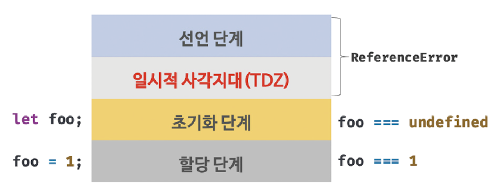

# 15. let, const 키워드와 블록 레벨 스코프

## 🏷 var 키워드로 선언한 변수의 문제점

### 1.1 변수 중복 선언 허용

```
- 초기값을 할당하는 문이 있는 변수 선언문이 중복 된다면 var 키워드가 없는 것 처럼 동작하고,
- 초기값을 할당하는 문이 없는 변수 선언문이 중복된다면 무시된다.
```

### 1.2 함수 레벨 스코프

```
- var 키워드로 선언한 변수는 함수 코드블록만 지역 스코프로 인정한다.
- for 문의 변수 선언문에서 var 키워드로 선언한 변수도 전역 변수가 된다.
- 함수 레벨 스코프는 전역 변수를 남발할 가능성을 높이고, 중복 선언이 될 가능성이 높다.
```

### 1.3 변수 호이스팅

```
- var 키워드로 변수 선언 시 변수 호이스팅에 의해 스코프의 선두로 끌어올려진 것처럼 동작한다.
- 할당문 이전에 변수를 참조하면 항상 undefined를 반환한다.
```

<br />

## 🏷 let 키워드

### 2.1 변수 중복 선언 금지

```
- let 키워드로 중복 선언 시 문법 에러(SyntaxError)가 발생한다.
```

### 2.2 블록 레벨 스코프

```
- let 키워드로 선언한 변수는 모든 코드 블록(함수, if, for, while, try/catch 등)을 지역스코프로 인정
```

### 2.3 변수 호이스팅

```
- let 키워드로 선언한 변수는 변수 호이스팅이 발생하지 않는 것처럼 동작한다.
- let 키워드로 선언한 변수를 변수 선언 이전에 참조하면 참조 에러(ReferenceError)가 발생한다.
- var 변수는 런타임 이전에 선언 단계와 초기화 단계가 한번에 실행된다.
- 반면에 let 변수는 선언 단계와 초기화 단계가 분리되어 진행된다.
- 스코프의 시작 지점부터 초기화 시작 지점까지 변수를 참조할 수 없는 구간을 "일시적 사각지대", Temporal Dead Zone(TDZ)라고 한다.
```



```
- 자바스크립트는 let, const를 포함하여 모든 선언을 호이스팅하나 let, const, class는 호이스팅이 발생하지 않는 것 처럼 동작한다.
```

### 2.4 전역 객체와 let

```
- var 키워드로 선언한 전역 변수와 전역 함수, 선언하지 않는 변수에 값을 할당하는 "암묵적 전역"은 전역 객체 window의 프로퍼티가 된다.
- 그러나 let 키워드로 선언한 전역 변수는 전역 객체의 프로퍼티가 아니다.
```

<br />

## 🏷 const 키워드

```
- 상수(constant) 선언을 위해 사용한다.
```

### 3.1 선언과 초기화

```
- const 변수는 반드시 선언과 동시에 초기화해야한다. 그렇지 않으면 문법 에러(SyntaxError)가 발샌한다.
- const 키워드로 선언한 변수는 블록 레벨 스코프를 가지며 변수 호이스팅이 발생하지 않는 것처럼 동작한다.
```

### 3.2 재할당 금지

```
- const 키워드로 선언한 변수는 재할당이 금지된다.
```

### 3.3 상수

```
- 변수는 언제든지 재할당을 통해 변수 값을 변경할 수 있지만, 상수는 재할당이 금지된다.
- const 키워드로 선언된 변수에 원시 값을 할당한 경우, 원시 값은 "변경할 수 없는 값"이다.
- 일반적으로 상수의 이름은 대문자로 선언한다. (예: MAXIMUM)
- 여러 단어로 이루어진 경우 언더 스코어로 구분한다. (예: MAX_VALUE)
```

### 3.4 const 키워드와 객체

```
- const 키워드로 선언된 변수에 객체를 할당한 경우 값을 변경할 수 있다.
- const 키워드는 재할당을 금지할 뿐, "불변을 의미하지 않는다"
```

<br />

## 🏷 var vs let vs const

> 기본적으로 const를 사용하고 재할당이 필요한 경우에만 let을 한정해서 사용하는 것이 좋다.

```
- ES6을 사용한다면 var 키워드는 사용하지 않는다.
- 재할당이 필요한 경우에만 let 키워드를 사용하여 변수의 스코프를 최대한 좁게 만든다.
- 읽기 전용으로 사용하는 값에는 const 키워드를 사용한다.
- 변수를 선언할 때는 일단 const를 사용한 뒤에 재할당이 필요한지 고려한 뒤에 let으로 바꾸는 작업을 추천한다고 한다.
```
