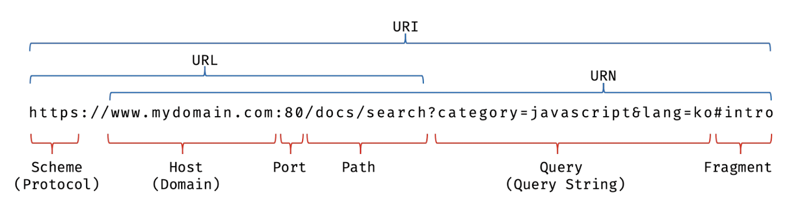

# 21. 빌트인 객체

- 2024.7.22

## 🏷 자바스크립트 객체의 분류

- 표준 빌트인 객체: ECMAScript에 정의된 객체, 애플리케이션 전역의 공통 기능 제공
- 호스트 객체: ECMAScript에는 정의되어있지 않지만 자바스크립트 실행환경에서 제공하는 객체
- 사용자 정의 객체: 기본 제공되는 객체가 아닌 사용자가 직접 정의한 객체

<br />

## 🏷 표준 빌트인 객체

```
- 40 개의 표준 빌트인 객체 제공
- Math, Reflect, JSON을 제외한 객체는 모두 인스턴스 생성 가능, 즉 모두 생성자 함수 객체
- 표준 빌트인 객체가 생성한 인스턴스의 프로토타입 => 표준 빌트인 객체의 prototype 프로퍼티에 바인딩된 객체
```

<br />

## 🏷 원시값과 래퍼 객체

> 래퍼 객체: 문자열, 숫자, 불리언 값에 대해 객체처럼 접근하면 생성되는 임시 객체

```
- 원시값은 프로퍼티나 메서드 불가, 그러나 객체처럼 동작 (예: str.length)
- 마침표 표기법으로 접근 시 일시적으로 연관된 객체로 변환 후 작업이 끝나면 다시 원시값으로 되돌린다. 이를 "래퍼 객체"라고 한다.
- null, undefined는 래퍼 객체 생성 불가 (객체처럼 사용 시 에러 발생)
```

#### 동작 순서

1. 마침표 표기법으로 접근
2. String 생성자 함수의 인스턴스 생성
3. 래퍼 객체의 [[StringData]]에 값 저장
4. String.prototype 메서드 사용 가능
5. 종료 시 [[StringData]]에서 할당한 값 제거, 래퍼 객체는 가비지 컬렉션의 대상이 됨

<br />

## 🏷 전역 객체

> 어떤 객체의 프로퍼티도 아니며 객체의 계층적 구조상 표준 빌트인 객체와 호스트 객체를 프로퍼티로 소유하는 객체

```
- 코드가 실행되기 이전 단계에서 자바스크립트 엔진에 의해 먼저 생성되는 특수한 객체
- 표준 빌트인 객체와 환경에 따른 호스트 객체, var 키워드의 전역 변수와 전역 함수를 프로퍼티로 가짐
```

#### 전역 객체 특징

- 개발자가 의도적으로 생성 불가
- 프로퍼티 참조 시 window 생략 가능
- 모든 표준 빌트인 객체를 프로퍼티로 가짐
- 실행 환경에 따라 추가적으로 프로퍼티와 메서드를 가짐
- var 키워드의 전역 변수와 선언하지 않은 변수에 값 할당
- var 키워드로 선언한 전역 함수는 전역 객체의 프로퍼티화
- let/const 키워드의 전역 변수는 전역 객체의 프로퍼티가 아님
- 브라우저 환경의 모든 코드는 전역 객체 window 공유

### 4.1 빌트인 전역 프로퍼티

> 즉, 전역 객체의 프로퍼티

```
- Infinity: 무한대를 나타내는 숫자 값
- NaN: 숫자가 아님을 나타내는 숫자 값 (Not a Number)
- undefined
```

### 4.2 빌트인 전역 함수

> 애플리케이션 전역에서 호출할 수 있는 빌트인 함수이자 전역 객체 메서드

```
- eval: 전달받은 문자열 코드가 표현식이라면 평가하여 런타임에 값 생성, 아니라면 런타임에 실행
- 인수로 전달받은 문자열 코드가 let/const로 선언한 변수라면 암묵적으로 strict mode 적용
- 최적화가 수행되지 않아 처리 속도가 느리므로 사용을 금지해야함
- isFinite: 유한수 검사 후 boolean으로 반환
- 단, isFinit(null)인 경우 true로 반환 (null이 0으로 치환되었기 때문)
- isNaN: 전달 받은 인수가 NaN인지 검사 후 boolean으로 반환
- parseFloat: 전달받은 인수를 실수로 해석하여 반환
- parseInt: 전달받은 인수를 정수로 해석하여 반환, 진법 기수 전달 가능
- 해당 지수의 숫자로 변환할 수 없다면 NaN 반환
- 숫자가 아닌 문자가 포함되어있다면 문자는 무시, 정수값만 반환 (숫자-문자 순으로 되어있어야함, 아닌 경우 NaN 반환)
```

#### encodeURI, decodeURI

```
- URI (Uniform Resource Identifier): 인터넷 자원을 나타내는 유일한 주소
```



```
- encodeURI: 완전한 URI를 문자열로 전달받아 이스케이프 처리를 위한 인코딩 방식
- decodeURI: 인코딩된 URI를 인수로 받아 이스케이프 처리 이전으로 디코딩하는 방식
- 이스케이프 처리: 네트워크를 통해 정보 공유 시 어떤 시스템에서도 읽을 수 있는 ASCII 문자 셋으로 변환하는 것 (예: '가' => '%EC%9E%90')
```

#### encodeURIComponent, decodeURIComponent

```
- encodeURIComponent: URI 구성 요소를 인수로 받아 인코딩하는 방식
- decodeURIComponent: 매개변수로 전달된 URI 구성 요소를 디코딩하는 방식
- encodeURIComponent는 인수로 전달된 문자열을 쿼리 스트링의 "일부"로 간주하나 encodeURI는 전달된 문자열을 완전한 URI 전체라고 간주한다.
```

### 4.3 암묵적 전역

```jsx
var x = 10;
function foo() {
  y = 20;
}
foo();
console.log(x + y); // 10
```

```
- 선언하지 않은 식별자는 선언된 전역 변수처럼 동작
- 따라서 y = 20을 window.y = 20으로 해석하여 전역 객체의 프로퍼티로 생각 => 암묵적 전역 (implicit global)
- y는 변수가 아니기 때문에 변수 호이스팅은 발생하지 않고, delete 연산자로 삭제도 할 수 없다.
```
