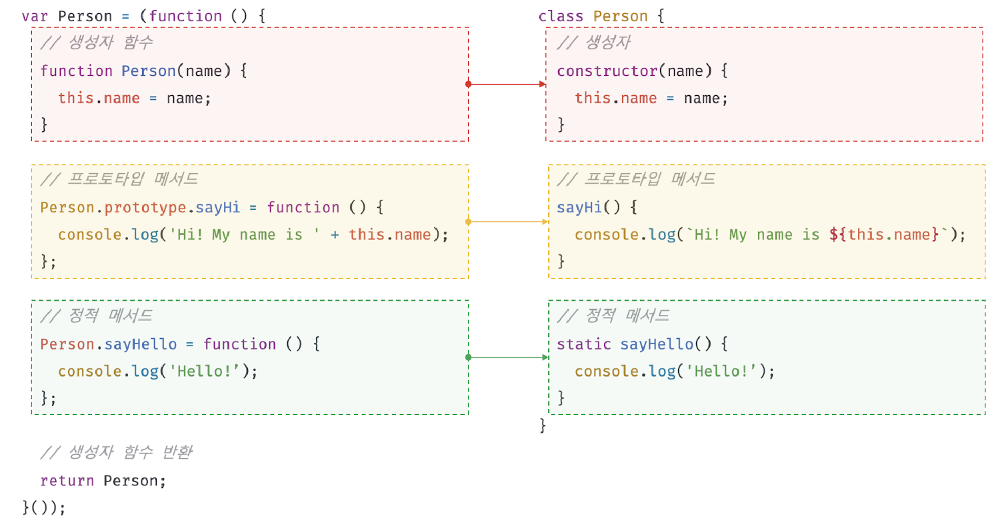

# 25. 클래스

- 2024.7.25, 2024.7.26

## 🏷 클래스는 프로토타입의 문법적 설탕인가?

> 🤔 문법적 설탕?!
>
> 영문으로는 Syntactic Sugar로 읽는 사람과 쓰는 사람이 편하게 디자인 된(맛있게 설탕 친) 문법이라는 뜻이다.<br />예) 단축 평가, 전개 구문(spread), null 병합 연산자, 삼항 조건 연산자 등

```
- 프로토타입 기반 객체지향 언어는 클래스 불필요 -> ES5에서는 생성자 함수와 프로토타입을 통해 상속 구현 가능
```

```jsx
var Person = (function () {
  function Person(name) {
    this.name = name;
  }

  Person.prototype.sayHi = function () {
    console.log(`Hi! My name is ${this.name}`);
  };

  return Person;
})();

var me = new Person('Harry');
me.sayHi(); // Hi! My name is Harry
```

```
- ES6에서 클래스 도입
- 실제로 클래스는 함수이며 기존 프로토타입 기반 패턴을 클래스 기반 패턴처럼 사용 => 새로운 객체 생성 매커니즘
```

- 클래스와 생성자 함수의 정의 방식 비교



| 구분 | 클래스 | 생성자 함수 |
| --- | --- | --- |
| new 연산자로 호출 | 에러 발생 | 일반함수로서 호출 |
| 상속 (extends, super) | O | X |
| 호이스팅 | 발생하지 않는 것처럼 동작 | 함수 선언문으로 정의된 함수 => 함수 호이스팅<br />함수 표현식으로 정의된 함수 => 변수 호이스팅 |
| strict mode | 암묵적으로 실행되나 해제 가능 | 암묵적으로 지정되지 않음 |

<br />

## 🏷 클래스 정의

```
- class 키워드를 사용하여 정의, 파스칼 케이스 사용
```

> 🤔 파스칼 케이스
>
> 첫 단어의 첫 글자를 대문자로 명명하는 규칙이다. ECAMScript 사양에 정의되어있는 객체와 함수도 파스칼 케이스를 사용한다. <br /> 예) helloworld => HelloWorld

```
- 표현식으로 클래스 정의 가능
- 값으로 사용할 수 있는 일급 객체
```

> 💡 일급 객체
>
> - 무영의 리터럴로 생성 가능
> - 변수나 자료구조에 저장 가능
> - 함수 매개변수에게 전달 가능
> - 함수의 반환값으로 사용 가능

```jsx
- 클래스 내에는 0개 이상의 메서드 정의 가능 (생성자, 프로토타입 메서드, 정적 메서드)
```

```jsx
class Person {
  // 생성자
  constructor(name) {
    this.name = name;
  }

  // 프로토타입 메서드
  sayHi() {
    console.log(`Hi! My name is ${this.name}`);
  }

  // 정적 메서드
  static sayHello() {
    console.log('Hello!');
  }
}

const me = new Person('Lee');

console.log(me.name); // Lee

me.sayHi(); // Hi! My name is Lee
Person.sayHello(); // Hello!
```

<br />

## 🏷 클래스 호이스팅

```
- 함수 선언문과 같이 런타임 이전에 먼저 평가되어 객체 생성
- 이떄 생성된 객체는 constructor이고 프로토타입도 함께 생성됨
- 클래스 선언문 이전에 TDZ에 빠지기 때문에 호이스팅이 발생하지 않는 것처럼 보임
- var, let, const, function, function*, class 모두 호이스팅됨
```

```jsx
const Person = '';

{
  // 호이스팅이 발생하지 않는다면 '' 출력 => 그러나 ReferenceError 발생
  console.log(Person);

  class Person {}
}
```

<br />

## 🏷 인스턴스 생성

```
- new 연산자와 함께 호출되어 인스턴스 생성
- 식별자를 사용해 인스턴스를 생성하지 않고 클래스 이름으로 생성하면 에러가 발생함
- 기명 함수 표현식과 마찬가지로 클래스 이름은 외부에서 접근 불가
```

<br />

## 🏷 메서드

### 5.1 constructor

> 인스턴스 생성 및 초기화 수행

```jsx
class Person {
  constructor(name) {
    this.name = name;
  }
}
```

```
- 이름 변경 불가, constructor로 고정
- 프로토타입 객체의 constructor 프로퍼티는 클래스 자신을 가리킴
- constructor는 반드시 한 개만 존재 가능, 그 이상 존재 시 SyntaxError 발생
- constructor 생략 시 빈 constructor가 암묵적으로 정의
- 프로퍼티가 추가되어 초기화된 인스턴스를 생성하려면 constructor 내 this에 인스턴스 프로퍼티 추가 (예: this.name = '...')
- 인스턴스 프로퍼티의 초기값 전달하려면 constructor의 매개변수에 초기값 전달
- 별도의 반환문 없음, 원시값 반환 시 암묵적으로 this 반환
```

### 5.2 프로토타입 메서드

```jsx
class Person {
  // ...

  sayHi() {
    console.log(`Hi! My name is ${this.name}`);
  }
}
```

```
- 클래스의 prototype 프로퍼티에 메서드를 추가하지 않아도 클래스 내부에 정의한 메서드는 기본적으로 프로토타입 메서드
- 클래스가 생성한 인스턴스는 프로토타입 체인의 일원
```

### 5.3 정적 메서드

```jsx
class Person {
  // ...

  static sayHi() {
    console.log('Hi!');
  }
}
```

```
- 인스턴스를 생성하지 않아도 호출 가능
- 메서드 앞에 static 키워드를 붙이면 정적 메서드가 됨
- 함수 객체로 평가되므로 자신의 프로퍼티와 메서드 소유 가능
- 인스턴스와 달리 별다른 생성 과정이 필요 없음 => 인스턴스 생성하지 않아도 호출 가능
```

### 5.4 정적 메서드와 프로토타입 메서드의 차이

1. 속해 있는 프로토타입 체인이 다르다
2. 정적 메서드는 클래스로, 프로토타입 메서드는 인스턴스로 호출
3. 프로토타입 메서드는 인스턴스 프로퍼티를 참조할 수 있으나 클래스는 못함

### 5.5 클래스에서 정의한 메서드의 특징

1. 메서드 축약 표현 사용 (function 키워드 생략)
2. 메서드 정의 시 콤마 불필요
3. 암묵적으로 strict mode로 실행
4. for...in 문이나 Object.keys 메서드로 열거 불가 (즉, [[Enumerable]] 어트리뷰트의 값 = false)
5. non-constructor

<br />

## 🏷 클래스의 인스턴스 생성 과정

#### 1. 인스턴스 생성과 this 바인딩

> 클래스 호출 시 인스턴스 생성, constructor 내부의 this는 이 인스턴스와 연결

#### 2. 인스턴스 초기화

> constructor의 인수로 전달받은 초기값으로 인스턴스 프로퍼티 초기화

#### 3. 인스턴스 반환

> 암묵적으로 this 반환

<br />

## 🏷 프로퍼티

### 7.1 인스턴스 프로퍼티

```
- constructor 내부에서 인스턴스 프로퍼티 정의
```

### 7.2 접근자 프로퍼티

```
- 자체적으로는 [[Value]], 즉 값을 갖지 않고 다른 데이터 프로퍼티의 값을 읽거나 저장할 때 사용하는 접근자 함수로 구성된 프로퍼티
- 인스턴스 프로퍼티에 접근할 때마다 값을 조작하는 getter 함수와 값을 할당할 때마다 조작하는 setter 함수 사용
```

### 7.3 클래스 필드 정의 제안

```
- 클래스 필드: 클래스가 생성할 인스턴스의 프로퍼티
- 자바스크립트 클래스의 내부에는 메서드만 선언 가능, 클래스 필드 선언 시 문법 에러 발생
- 클래스 필드를 정의하는 경우 this에 클래스 필드를 바인딩해서는 안됨 => this는 constructor와 메서드 내에서만 유효하기 때문
- 클래스 필드에 초기값을 할당하지 않으면 undefined
- 인스턴스 생성 시 외부의 초기값으로 클래스 필드를 초기화해야할 필요가 있다면 constructor에서 초기화 수행
```

```jsx
class Person {
  // 클래스 필드
  name;

  constructor(name) {
    // 클래스 필드 초기화
    this.name = name;
  }
}
```

### 7.4 private 필드 정의 제안

```
- 기존의 자바스크립트는 캡슐화나 접근 제한자를 지원하지 않음 => 항상 public
- TC39 stage 3에는 private 필드를 정의할 수 있는 새로운 표준 사양 제안 => private 필드의 선두에 '#'을 붙여 사용
```

```jsx
class Person {
  #name = '';

  constructor(name) {
    this.#name = name;
  }
}

const me = new Person('Lee');

console.log(me.#name); // SyntaxError
```

```
- public 필드는 어디서나 참조 가능, 그러나 private 필드는 클래스 내부에서만 참조 가능
```

| 접근 가능성                 | public | private |
| --------------------------- | ------ | ------- |
| 클래스 내부                 | O      | O       |
| 자식 클래스 내부            | O      | X       |
| 클래스 인스턴스를 통한 접근 | O      | X       |

```
- 외부에서 private 필드에 접근할 수는 없지만 접근자 프로퍼티를 통해 간접적으로 접근하는 것은 가능함
- 예) get name() { return this.#name }
- private 필드는 반드시 클래스 내부에 정의해야함
- 직접 constructor에 정의하면 에러 발생
```

### 7.5 static 필드 정의 제안

```
- static 키워드로 정적 필드 정의 불가
- TC39 stage 3의 Static class features에 새로운 방법 제안
```

```jsx
class MyMath {
  // static public
  static PI = 22 / 7;

  // static private
  static #num = 10;

  // static 메서드
  static increment() {
    return ++MyMath.#num;
  }
}
```

<br />

## 🏷 상속에 의한 클래스 확장

### 8.1 클래스 상속과 생성자 함수 상속

```
- 상속에 의한 클래스 확장: 기존 클래스를 상속받아 새로운 클래스를 확장하여 정의하는 것
- 코드 재사용 관점에서 매우 유용
- 클래스를 확장할 수 있는 extends 키워드를 기본적으로 제공
-
```

```jsx
class Animal {
  constructor(age, weight) {
    this.age = age;
    this.weight = weight;
  }

  eat() {
    return 'eat';
  }

  move() {
    return 'move';
  }
}

class Bird extends Animal {
  fly() {
    return 'fly';
  }
}

const bird = new Bird(1, 5);
console.log(bird instanceof Animal); // true
console.log(bird.fly()); // fly
console.log(bird.eat()); // eat
```

### 8.2 extends 키워드

```
- 서브클래스(파생클래스, 자식클래스): 상속을 통해 확장된 클래스
- 수퍼클래스(베이스 클래스, 부모 클래스): 서브클래스에서 상속된 클래스
- extends 키워드로 상속받을 클래스를 정의 및 수퍼클래스와 서브클래스 간 상속 관계 설정
- 클래스 간 프로토타입 체인 생성 가능 => 프로토타입 메서드, 정적 메서드 모두 상속
```

### 8.3 동적 상속

```
- extends 키워드로 생성자 함수를 상속받아 클래스 확장
- extends 키워드 다음에는 [[Construct]] 내부 메서드를 갖는 함수 개체로 평가될 수 있는 모든 표현식 사용 가능
```

```jsx
function Base1() {}

class Base2 {}

let condition = true;

class DeRived extends (condition ? Base1 : Base2) {}
const derived = new Derived();
console.log(derived instanceof Base1); // true
console.log(derived instanceof Base2); // false
```

### 8.4 서브클래스의 constructor

```
- constructor 생략 시 비어있는 constructor로 암묵적 정의
- super()는 수퍼클래스의 constructor를 호출하여 인스턴스를 생성
```

### 8.5 super 키워드

```jsx
class Base {
  constructor() {}
}

class Derived extends Base {
  contructor(...args) {
    super(...args);
  }
}
```

```
- this와 같이 식별자처럼 참조할 수 있는 특수한 키워드
- 함수처럼 호출도 가능
```

#### super 호출

> super 호출 시 수퍼클래스의 constructor 호출

```
- 서브클래스를 호출하면서 전달한 인수는 모두 서브클래스에 암묵적으로 정의된 constructor의 super 호출을 통해 수퍼클래스의 constructor에 전달
```

- 주의사항
  1.  서브클래스에서 constructor를 생략하지 않는 경우 반드시 constructor에서 super를 호출해야함
  2.  서브클래스의 constructor에서 super를 호출하기 전에는 this 참조 불가
  3.  super는 반드시 서브클래스의 constructor에서만 호출

#### super 참조

> 메서드 내에서 super 참조 시 수퍼클래스의 메서드 호출 가능

```
- super 참조로 수퍼클래스의 메서드를 참조하려면 => 수퍼클래스의 prototype 프로퍼티에 바인딩된 프로토타입을 참조할 수 있어야함
- super 참조가 동작하기 위해서 => super를 참조하고 있는 메서드가 바인딩되어있는 객체의 프로토타입을 찾을 수 있어야함
- 내부 슬롯 [[HomeObject]]: 자신을 바인딩하고 있는 객체 표시
- [[HomeObject]]을 가져야만 super 참조를 할 수 있음 => ES6 메서드 축약 표현으로 정의된 함수만 [[HomeObject]]을 가짐
```

### 8.6 상속 클래스의 인스턴스 생성 과정

#### 1. 서브클래스의 super 호출

```
- 내부 슬롯 [[ConstructorKind]]: 수퍼클래스와 서브클래스 구분 (base or derived 값)
- 서브클래스는 수퍼클래스에게 인스턴스 생성 위임 => 즉, 서브클래스의 constructor에서 반드시 super을 호출해야함
```

#### 2. 수퍼클래스의 인스턴스 생성과 this 바인딩

> 수퍼클래스의 constructor 내부의 this는 생성된 인스턴스

#### 3. 수퍼클래스의 인스턴스 초기화

> this에 바인딩 되어있는 인스턴스에 프로퍼티 추가, constructor가 인수로 전달받은 초기값으로 인스턴스 프로퍼티 초기화

#### 4. 서브클래스 constructor로의 복귀와 this 바인딩

```
- super가 반환한 인스턴스가 this에 바인딩
- 서브클래스는 별도의 인스턴스 생성 없이 super가 반환한 인스턴스를 this에 바인딩하여 그대로 사용
- super가 호출되지 않으면 인스턴스 생성하지 않고, this 바인딩도 하지 않음
- 즉, 서브클래스의 constructor에서 super를 호출하기 전에 this 참조 불가
```

#### 5. 서브클래스의 인스턴스 초기화

> 3번과 동일

#### 6. 인스턴스 반환

> 모든 처리가 끝나면 완성된 인스턴스에 바인딩된 this를 암묵적으로 반환

### 8.7 표준 빌트인 생성자 함수 확장

```
- Array 생성자 함수를 상속받아 확장한 클래스가 생성한 인스턴스 => Array.prototype, Class.prototype의 모든 메서드 사용 가능
- 연산 결과로 새로운 배열 반환 시 (map, filter) 클래스의 인스턴스 반환
- 클래스의 특정 메서드가 클래스의 인스턴스가 아닌 Array가 생성한 인스턴스를 반환하게 하려면 => Symbol.species로 정적 접근자 프로퍼티 추가
```

```jsx
class MyArray extends Array {
  static get [Symbol.species]() {
    return Array;
  }

  uniq() {
    return this.filter((v, i, self) => self.indexOf(v) === i);
  }

  average() {
    return this.reduce((pre, cur) => pre + cur, 0) / this.length;
  }
}

const myArray = new MyArray(1, 1, 2, 3);
console.log(myArray.uniq().average()); // TypeError: myArray.uniq(...).average is not afunction
```
