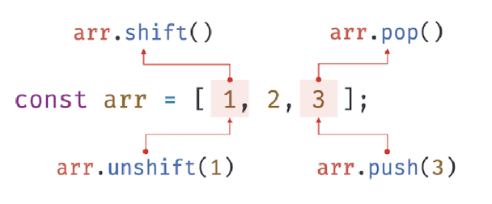

# 27. 배열

- 2024.7.28

## 🏷 배열이란?

> 여러 개의 값을 순차적으로 나열한 자료구조

```jsx
const arr = ['apple', 'banana', 'grape'];
console.log(arr[0]); // apple
console.log(arr[2]); // grape
```

```
- 요소(element): 배열이 가지고 있는 값, 자바스크립트에서 값으로 인정하는 모든 값 가능
- 인덱스: 자신의 위치를 나타내는 0 이상의 정수, 배열의 요소 검색 시 사용
- 인덱스 사용 방법 => 대괄호 내에 요소의 인덱스 작성 (예: arr[0])
- for문을 통해 순차적으로 요소에 접근할 수 있는 이터러블
- 배열은 객체 타입
- 배열 리터럴, Array 생성자 함수, Array.of, Array.from 메서드오 생성 가능
```

- 배열과 객체의 차이

| 구분            | 객체                      | 배열          |
| --------------- | ------------------------- | ------------- |
| 구조            | 프로퍼티 키와 프로퍼티 값 | 인덱스와 요소 |
| 값의 참조       | 프로퍼티 키               | 인덱스        |
| 값의 순서       | X                         | O             |
| length 프로퍼티 | X                         | O             |

```
- 일반 객체와 배열 구분하기 : 값의 순서와 length 프로퍼티
- 인덱스로 표현되는 순서와 length 프로퍼티를 갖는 배열은 순차적으로 값에 접근하기 적합한 자료구조
```

<br />

## 🏷 자바스크립트 배열은 배열이 아니다

```
- 자료구조에서 배열은, 동일한 크기의 메모리 공간이 빈틈없이 연속적으로 나열된 자료구조 => 밀집 배열
- 정렬되지 않은 배열에 특정 요소 검색 시 시간 복잡도는 O(n)
- 또한 배열에 요소를 삽입/삭제하는 경우 배열을 연속적으로 유지하기 위해 요소를 이동시켜야함
- 자바스크립트의 배열은, 메모리 공간이 동일한 크기가 아니며 연속적으로 나열되지 않은 자료구조 => 희소 배열
- 즉, 자바스크립트의 배열은 일반적인 배열의 동작을 흉내 낸 특수한 객체
- 자바스크립트 배열은 일반적인 배열보다 느리지만 요소를 삽입/삭제하는 경우 일반적인 배열보다 빠름
```

<br />

## 🏷 length 프로퍼티와 희소 배열

```jsx
[].length; // 0
[1, 2, 3].length; // 3
```

```
- length 프로퍼티: 배열 길이를 나타내는 0 이상의 정수 값
- 빈 배열일 경우 0, 빈 배열이 아닐 경우 가장 큰 인덱스 + 1
- 배열에 요소를 추가/삭제 시 자동 갱신
- 만약 length에 length 값보다 더 큰 값을 할당하는 경우 값은 바뀌지만 실제 배열은 변하지 않음
```

```jsx
const arr = [1];
arr.length = 3;
console.log(arr.length); // 3
console.log(arr); // [1, empty, empty]
```

```
- 회소 배열의 경우 length와 배열 요소의 개수가 일치하지 않음
- 회소 배열의 length는 희소 배열의 실제 요소 개수보다 언제나 많음
```

<br />

## 🏷 배열 생성

### 4.1 배열 리터럴

```
- 0개 이상의 요소를 쉼표로 구분하여 대괄호로 묶는 방식
- 프로퍼티 키 없이 값만 존재
```

```jsx
const arr = [1, 2, 3];
console.log(arr.length); // 3
```

```
- 배열에 요소를 하나도 추가하지 않으면 length 프로퍼티의 값은 0
- 배열 리터럴에 요소 생략 시 희소 배열 생성 (예: [1, , 3])
```

### 4.2 Array 생성자 함수

- 전달된 인수가 1개이고 숫자인 경우 => length 프로퍼티 값이 인수인 희소 배열 생성

```jsx
const arr = new Array(10);
console.log(arr); // [empty * 10]
console.log(arr.length); // 10
```

- 전달된 인수가 없는 경우 빈 배열 생성

```jsx
const arr = new Array();
console.log(arr); // []
console.log(arr.length); // 0
```

- 전달된 인수가 2개 이상이거나 숫자가 아닌 경우 => 인수를 요소로 갖는 배열 생성

```jsx
const arr = new Array(1, 2, 3);
console.log(arr); // [1, 2, 3]
console.log(arr.length); // 3
```

### 4.3 Array.of

```
- 전달된 인수를 요소로 갖는 배열 생성
- 인수가 1개이거나 숫자여도 인수를 요소로 가짐
```

```jsx
Array.of(1); // [1]
Array.of('string'); // ['string]
```

### 4.4 Array.from

```jsx
Array.from({ length: 3 });
Array.from({ length: 3 }, (_, i) => i);
```

```
- 유사 배열 객체(이터러블 객체)를 인수로 받아 배열로 변환하여 반환
- 두번째 인수로 값을 만들면서 요소 채우기 가능
```

> 💡 유사 배열 객체
>
> 마치 배열처럼 인덱스로 프로퍼티 값에 접근할 수 있고, length 프로퍼티를 갖는 객체를 말한다. for문으로 순회할수도 있다.

<br />

## 🏷 배열 요소의 참조

```
- 인덱스 => 값을 참조할 수 있다는 의미에서 객체의 프로퍼티 키와 같은 역할
- 존재하지 않는 요소에 접근 시 undefined 반환
```

```jsx
const arr = [1, 2];

console.log(arr[0]); // 1
console.log(arr[2]); // undefined
```

<br />

## 🏷 배열 요소의 추가와 갱신

```
- 배열에 요소를 동적으로 추가할 수 있음
- 이미 요소가 존재할 때 값을 재할당하면 값이 갱신됨
- 정수 이외의 값을 인덱스처럼 사용 시 프로퍼티 생성 주의
```

```jsx
const arr = [];

arr[0] = 1;
arr['1'] = 2;
arr['foo'] = 3;

console.log(arr); // [1, 2, foo: 3]
```

<br />

## 🏷 배열 요소의 삭제

```
- delete 연산자로 배열의 특정 요소 삭제
- 그러나 delete는 희소 배열을 만들기 때문에 사용하지 않는 것이 좋음
- Array.prototype.splice 메서드를 대신 사용 권장
```

```jsx
const arr1 = [1, 2, 3];

delete arr1[1];
console.log(arr1); // [1, empty, 3]
console.log(arr1.length); // 3

const arr2 = [1, 2, 3];

arr2.splice(1, 1);
console.log(arr2); // [1, 2]
console.log(arr2.length); // 2
```

<br />

## 🏷 배열 메서드

```
- Array 생성자 함수 => 정적 메서드 제공
- Array.prototype => 프로토타입 메서드 제공
- Mutator method: 원본 배열을 직접 변경
- Accessor Method: 원본 배열을 직접 변경하지 않고 새로운 배열을 생성하여 반환
- 가급적 원본 배열을 직접 변경하지 않는 펀이 좋음
```

### 8.1 Array.isArray

> 전달된 인수가 배열이면 true, 아닐 경우 false

```jsx
Array.isArray([]); // true
Array.isArray({}); // false
```

### 8.2 Array.prototype.indexOf

> 원본 배열에서 인수로 전달된 요소를 검색하여 인덱스 반환

```jsx
const arr = [1, 2, 2, 3];
arr.indexOf(2); // 1
arr.indexOf(2, 2); // 2

// ES7에 도입된 Array.prototype.includes를 쓰면 가독성이 더 좋다
const numbers = [1, 2, 3, 4];
if (!numbers.includes(1)) {
  foods.push(1);
}
```

### 8.4 Array.prototype.push

> (원본 변경) 인수로 전달받은 값을 원본 배열의 마지막 요소로 추가 및 변경된 length 프로퍼티 값 반환

```jsx
const arr = [1, 2];

let result = arr.push(3, 4);
console.log(result); // 4
console.log(arr); // [1, 2, 3, 4]
```

```
- 단, 성능 면에서 좋지 않음
- 또한 원본 배열을 원본 변경하는 부수 효과가 있기 때문에 spread 문법을 사용하는 편이 좋음
```

### 8.4 Array.prototype.pop

> (원본 변경) 원본 배열에서 마지막 요소를 제거하고 제거한 요소 또는 undefined 반환

```jsx
const arr = [1, 2];
let result = arr.pop();
console.log(result); // 2
console.log(arr); // [1]
```

```
- 스택은 LIFO 방식의 자료구조 (Last In First Out: 후입선출)
- push와 pop으로 쉽게 구현 가능
```

### 8.5 Array.prototype.unshift

> (원본 변경) 전달받은 값을 원본 배열의 선두 요소로 추가 및 변경된 length 프로퍼티 반환

```jsx
const arr = [1, 2];
let result = arr.unshift(3, 4);
console.log(result); // 4
console.log(arr); // [3, 4, 1, 2]
```

```
- unshift 메서드는 원본 배열을 직접 변경하기 때문에 spread 문법을 사용하는 편이 좋음
```

### 8.6 Array.prototype.shift

> (원본 변경) 원본 배열에서 첫번째 요소를 제거하고 제거한 요소 또는 undefined 반환

```jsx
const arr = [1, 2];
let result = arr.shift();
console.log(result); // 1
console.log(arr); // [2]
```

```
- 큐는 FIFO 방식의 자료구조 (First In First Out: 선입선출)
- unshift(FI)과 shift(FO)로 쉽게 구현 가능
```

- push, pop, shift, unshift 한눈에 보기



### 8.7 Array.prototype.concat

> 전달된 값들을 원본 배열의 마지막 요소로 추가해 새로운 배열 반환

```jsx
const arr1 = [1, 2];
const arr2 = [3, 4];

let result = arr1.concat(arr2);
console.log(result); // [1, 2, 3, 4]

result = arr2.concat(arr1);
console.log(result); // [3, 4, 1, 2]
```

```
- push와 unshift 메서드는 concat 메서드를 대체할 수 있음
- 그러나 위 두 메서드는 원본 배열을 직접 변경하나 concat은 새로운 배열을 반환한다는 차이가 있음
- concat 메서드는 spread 문법으로 대체 가능 (예: [...arr1, ...arr2])
```

### 8.8 Array.prototype.splice

> (원본 변경) 원본 배열의 중간에 요소를 추가/삭제

- `splice(start, deleteCount, items)`
  - start: 요소를 제거하기 시작할 인덱스
  - deleteCount: 제거할 요소의 개수
  - items: 제거한 위치에 삽입할 요소 목록

```jsx
const arr = [1, 2, 3, 4];

const result = arr.splice(1, 2, 20, 30);
// 인덱스 1부터 2개의 요소를 제거하고 그자리에 20과 30을 추가한다
console.log(result); /// [2, 3]
console.log(arr); // [1, 20, 30, 4]
```

```
- 배열에서 특정 요소 제거 시 indexOf 메서드로 특정 요소의 위치를 파악한 다음 splice 메서드로 제거하면 됨
- filter 메서드로 제거할 수도 있음 (단, 중복된 값일 경우 모두 삭제)
```

### 8.9 Array.prototype.slice

> 전달된 범위의 요소들을 복사하여 배열로 반환

- `slice(start, end)`
  - start: 복사를 시작할 인덱스
  - end: 복사를 종료할 인덱스 + 1 (생략 시 끝까지)

```jsx
const arr = [1, 2, 3];
// 0부터 1 - 1까지 추출
arr.slice(0, 1); // [1]
// 1부터 3 - 1까지 추출
arr.slice(1, 3); // [2, 3]
```

```
- 인수를 모두 생략하면 원본 배열의 복사본 생성하여 반환 (얕은 복사)
- 이 복사를 이용하여 arguments, HTMLCollection, NodeList 등 유사 배열 객체를 배열로 변환 가능 (Array.from으로 더 간단하게도 가능)
```

> 💡 얕은 복사와 깊은 복사
>
> 얕은 복사: 한 단계까지만 복사하는 것 (중첩 객체 제외)<br />
>
> - Array.slice, spread, Object.assign
>
> 깊은 복사: 중첩 되어 있는 객체까지 모두 복사하는 것
>
> - Lodash 라이브러리의 cloneDeep

### 8.10 Array.prototype.join

> 원본 배열의 요소를 문자열로 변환한 후 인자로 받은 구분자로 연결한 문자열 반환

```jsx
const arr = [1, 2, 3, 4];

arr.join(); // '1,2,3,4'
arr.join(''); // '1234'
arr.join(':'); // '1:2:3:4
```

### 8.11 Array.prototype.reverse

> (원본 변경) 원본 배열의 순서를 뒤집는 메서드

```jsx
const arr = [1, 2, 3];
const result = arr.reverse();

console.log(result); // [3, 2, 1]
```

### 8.12 Array.prototype.fill

> (원본 변경) 전달받은 값으로 배열을 채우는 메서드

- `fill(element, start, end)`
  - element: 배열을 채울 요소
  - start: 요소를 채우기 시작할 위치
  - end: 요소를 채우는 마지막 위치

```jsx
const arr = [1, 2, 3];
arr.fill(0);
console.log(arr); // [0, 0, 0]

// array 생성 방식과 함께 사용하면 배열을 만드는 동시에 값 전달 가능
const arr2 = new Array(3).fill(1);
console.log(arr2); // [1, 1, 1]
```

### 8.13 Array.prototype.includes

> 배열 내에 특정 요소가 포함되어 있는지 확인하여 boolean 반환

- `includes(element, start)`
  - element: 배열에서 찾을 요소
  - start: 검색을 시작할 인덱스

```jsx
const arr = [1, 2, 3];
arr.includes(2); // true
arr.includes(100); // false
```

```
- indexOf 메서드를 사용해도 배열 내에 특정 요소가 포함되어있는지 확인 가능
- 그러나 배열에 NaN이 포함되어있는지 확인 불가능
```

### 8.14 Array.prototype.flat

> ECMAPScript 2019(ES10)에서 도입, 전달한 깊이만큼 재귀적으로 배열 평탄화

```jsx
[1, [2, 3, 4, 5]].flat(); // [1,2,3,4,5]

[1, [2, [3, [4]]]].flat(); // [1, 2, [3, [4]]]
[(1, [2, [3, [4]]])].flat(2); // [1, 2, 3, [4]]
[1, [2, [3, [4]]]].flat().flat(); // [1, 2, 3, [4]]
[1, [2, [3, [4]]]].flat(Infinity); // [1, 2, 3, 4]
```

<br />

## 🏷 배열 고차 함수

```
- 고차 함수: 함수를 인자로 전달하거나 함수를 반환하는 함수
- 외부 상태의 변경이나 가변 데이터를 피하고 불변성을 지향함
- 함수형 프로그래밍: 로직 내에 존재하는 조건문과 반복문을 제거하여 복잡성을 해결하고 변수 사용을 억제하여 상태 변경을 피하려는 프로그래밍 패러다임
```

### 9.1 Array.prototype.sort

> (원본 변경) 배열 요소 정렬 및 정렬된 배열 반환

```jsx
const fruits = ['banana', 'orange', 'apple'];
fruits.sort();
console.log(fruits); // ['apple', 'banana', 'orange']
```

```
- 내림차 순으로 요소를 정렬하려면 sort으로 오룸차순 정렬 후 reverse 메서드를 사용하면 됨
- sort 메서드의 기본 정렬 순서는 유니코드 코드 포인트 => [1, 2, 100]를 정렬하면 [1, 100, 2]가 됨
```

> 🤔 코드 포인트란?
>
> 텍스트를 표현하기 위한 시스템에서 추상 문자를 나타내기 위해 할당된 숫자이다. 예를 들면, 유니코드에서 코드 포인트는 U+1234 형식으로 표현되고 문자 'A'에는 'U+0041'의 코드 포인트가 할당된다. - MDN

<br />

```
- 따라서 숫자 요소 정렬 시 정렬 순서를 정의하는 비교 함수를 인수로 전달
- 비교함수의 반환값이 0보다 작으면 첫번째 인수 우선, 0이면 정렬 하지 않고, 0보다 크면 두번째 인수 우선 정렬
```

```jsx
const points = [40, 100, 1, 5, 2, 25, 10];
points.sort((a, b) => a - b); // [1, 2, 5, 10, 25, 100]
```

### 9.2 Array.prototype.forEach

> for문을 대체할 수 있는 고차함수

```jsx
const number = [1, 2, 3];
const pows = [];

numbers.forEach(item => pows.push(item ** 2));
console.log(pows);
```

```
- forEach 메서드의 콜백 함수는 배열의 요소값과 인덱스, 배열 자체(this)를 순차적으로 전달 받음
- forEach 메서드는 원본 배열을 변경하지 않으나 콜백 함수를 통해 변경할 수 있음
- forEach 메서드의 반환 값 => undefined
- 화살표 함수 내에서 this 참조 시 상위 스코프의 this 참조
- for문과는 달리 break, continue 사용 가능
- 희소 배열의 경우 존재하지 않는 요소는 순회 대상에서 제외됨 (map, filter, reduce 또한 마찬가지)
```

### 9.3 Array.prototype.map

> 콜백 함수의 반환값들로 구성된 새로운 배열 반환

```jsx
const numbers = [1, 4, 9];
const roots = numbers.map(item => Math.sqrt(item));
console.log(roots); // [1, 2, 3]
console.log(numbers); // [1, 4, 9]
```

```
- map 메서드를 호출한 배열과 map 메서드가 생성한 배열은 1:1 매핑됨
- 배열의 요소값과 인덱스, this를 순차적으로 전달받음
- 화살표 함수를 사용하면 this 바인딩을 갖지 않아 상위 스코프의 this를 그대로 참조
```

### 9.4 Array.prototype.filter

> 콜백 함수의 반환값이 true인 요소로만 구성된 새로운 배열 반환

```jsx
const numbers = [1, 2, 3, 4, 5];
const odds = numbers.filter(item => item % 2);
console.log(odds); // [1, 3, 5]
```

```
- 자신을 호출한 배열에서 특정 요소를 제거하기 위해 사용 가능 (중복된 요소 모두 제거)
- 하나만 제거하기 => indexOf 메서드 + splice 메서드
```

### 9.5 Array.prototype.reduce

> 콜백 함수를 호출하여 하나의 결과값 반환

```jsx
const sum = [1, 2, 3, 4].reduce(
  (accumulator, currentValue, index, array) => accumulator + currentValue,
  0
);
console.log(sum); // 10
```

```
- 첫번째 인수로 콜백함수, 두번째 인수로 초기값 전달받음
- 콜백 함수는 4개의 인수를 전달받아 배열의 길이만큼 호출됨
```

#### 평균 구하기

```jsx
const values = [1, 2, 3];
const average = values.reduce((acc, cur, i, { length }) => {
  return i === length - 1 ? (acc + cur) / length : acc + cur;
});
```

#### 최댓값 구하기

```jsx
const values = [1, 2, 3, 4, 5];
const max = values.reduce((acc, cur) => (acc > cur ? acc : cur), 0);
```

#### 중복 횟수 구하기

```jsx
const fruits = ['banana', 'apple', 'orange', 'orange', 'apple'];
const count = fruits.reduce((acc, cur) => {
  acc[cur] = (acc[cur] || 0) + 1;
  return acc;
}, {});
```

#### 중첩 배열 평탄화

```jsx
const values = [1, [2, 3], 4, [5, 6]];
const flatten = values.reduce((acc, cur) => acc.concat(cur), []);
```

#### 중복 요소 제거

```jsx
const values = [1, 2, 1, 3, 5, 4, 5, 3, 4, 4];
const result = values.reduce((unique, val, i, _values) =>
  _values.indexOf(val) === i ? [...unique, val] : unique
);
```

### 9.6 Array.prototype.some

> 콜백 함수의 반환값이 한 번이라도 참이면 true, 모두 거짓이면 false 반환

```jsx
[5, 10, 15].some(item => item > 10); // true
[5, 10, 15].some(item => item < 0); // false
```

### 9.7 Array.prototype.every

> 콜백 함수의 반환값이 모두 참이라면 true, 단 한번이라도 거짓이면 false 반환

```jsx
[5, 10, 15].some(item => item > 3); // true
[5, 10, 15].some(item => item > 10); // false
```

### 9.8 Array.prototype.find

> 배열을 순회하며 콜백 함수를 호출하여 반환값이 true인 첫번째 요소 반환, true인 요소가 없다면 undefined

```jsx
const users = [
  { id: 1, name: 'Lee' },
  { id: 2, name: 'Kim' },
  { id: 2, name: 'Choi' },
  { id: 3, name: 'Park' },
];
users.find(user => user.id === 2); // {id: 2, name: 'Kim'}
```

### 9.9 Array.prototype.findIndex

> 배열을 순회하며 콜백 함수를 호출하여 반환값이 true인 첫번째 요소의 인덱스 반환, true인 요소가 없다면 -1 반환

```jsx
const users = [
  { id: 1, name: 'Lee' },
  { id: 2, name: 'Kim' },
];

users.findIndex(user => user.id === 2); // 1
users.findIndex(user => user.name === 'Park'); // -1
```

### 9.10 Array.prototype.flatMap

> ES10에서 도입, map 메서드를 통해 생성된 새로운 배열을 평탄화하여 반환

```jsx
const arr = ['hello', 'world'];
arr.map(x => x.split(' ')).flat();
// ['h', 'e', 'l', 'l', 'o', 'w', 'o', 'r', 'l', 'd']
arr.flatMap(x => x.split(' '));
// ['h', 'e', 'l', 'l', 'o', 'w', 'o', 'r', 'l', 'd']
```
