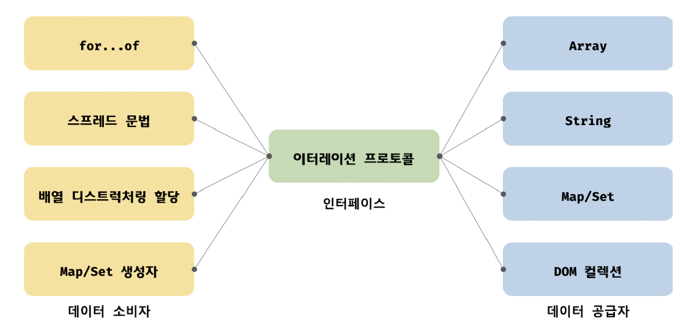

# 34. 이터러블

- 2024.8.2

## 🏷 이터레이션 프로토콜

```
- 순회 가능한 데이터 컬렉션을 만들기 위해 ECMAScript 사양에 정의되어있는 규칙
- 이터러블: 이터러블 프로토콜을 준수한 객체, for..of문으로 순회, 스프레드 문법과 배열 디스트럭처링 사용 가능
- 이터러블 프로토콜: Symbol.iterator를 프로퍼티 키로 사용한 메서드 직접 구현 또는 프로토타입 체인을 통해 상속 받은 Symbol.iterator 메서드 호출 => 이터러블 프로토콜을 준수한 이터레이터 반환
- 이터레이터: 이터레이터 프로토콜을 준수한 객체, next 메서드 소유, value와 done 객체를 갖는 이터레이터 리절트 객체 반환
```

### 1.1 이터러블

> 이터러블 프로토콜을 준수한 객체

```jsx
const isIterable = v => v !== null && typeof v[Symbol.iterator] === 'function';

isIterable([]); // true
isIterable({}); // false
```

```
- 예) 배열 => Array.prototype과 Symbol.iterator 메서드를 상속받는 이터러블
```

### 1.2 이터레이터

```
- 이터러블의 Symbol.iterator 메서드가 반환한 이터레이터 => next 메서드 포함
- next 메서드: 이터러블의 각 요소 순회, Iterator Result Object 반환
- done 프로퍼티: 이터러블의 순회 완료 여부 표시
```

```jsx
const array = [1, 2, 3];

const iterator = array[Symbol.iterator]();

console.log(iterator.next()); // {value: 1, done: false}
console.log(iterator.next()); // {value: 2, done: false}
console.log(iterator.next()); // {value: 3, done: false}
console.log(iterator.next()); // {value: undefined, done: true}
```

<br />

## 🏷 빌트인 이터러블

| 빌트인 이터러블 | Symbol.iterator 메서드 |
| --- | --- |
| Array | Array.prototype[Symbol.iterator] |
| String | String.prototype[Symbol.iterator] |
| Map | Map.prototype[Symbol.iterator] |
| Set | Set.prototype[Symbol.iterator] |
| TypedArray | TypedArray.prototype[Symbol.iterator] |
| arguments | arguments[Symbol.iterator] |
| DOM 컬렉션 | NodeList.prototype[Symbol.iterator]<br />HTMLCollection.prototype[Symbol.iterator] |

<br />

## 🏷 for...of문

```jsx
for (const item of [1, 2, 3]) {
  console.log(item); // 1 2 3
}
```

```
- 이터러블의 요소를 변수에 할당
- 문법: for (변수선언문 of 이터러블) { ... }
- 프로토타입 체인 상 존재하는 모든 프로토타입 프로퍼티 중 [[Enumerable]]이 true인 프로퍼티를 순회하며 열거 (심벌 제외)
- next 메서드 호출 => 이터레이터 리절트 객체의 valeu 프로퍼티 값을 for문 변수에 할당 => done 프로퍼티 값이 false라면 순회 지속 => true라면 순회 중단
```

<br />

## 🏷 이터러블과 유사 배열 객체

```
- 유사 배열 객체: 마치 배열처럼 인덱스로 프로퍼티 값에 접근 가능, length 프로퍼티를 가짐, for문으로 순회 가능, 인덱싱 가능
- 유사 배열 객체는 일반 객체이기 때문에 Symbol.iterator 메서드 없음 => for문으로 순회 불가
- 이때 Array.from 메서드를 사용하면 배열로 간단히 변환 가능
```

```jsx
const arrayLike = {
  0: 1,
  1: 2,
  2: 3,
  length: 3,
};

const arr = Array.from(arrayLike);
```

<br />

## 🏷 이터레이션 프로토콜의 필요성

```
- 데이터 소비자와 공급자를 연결하는 인터페이스 역할
- 이터러블은 for...of문, 스프레드 문법, 배열 디스트럭처링 할당과 같은 데이터 "공급자"의 역할을 함
```



<br />

## 🏷 사용자 정의 이터러블

### 6.1 사용자 정의 이터러블 구현

```jsx
const fibonacci = {
  [Symbol.iterator]() {
    let [pre, cur] = [0, 1];
    const max = 10;

    return {
      next() {
        [pre, cur] = [cur, pre + cur];
        return { value: cur, done: cur >= max };
      },
    };
  },
};
```

```
- 이터레이션 프로토콜은 일반 객체도 프로토콜을 준수하도록 구현하면 "사용자 정의 이터러블"이 됨
- 사용자 정의 이터러블: 이터레이션 프로토콜을 준수하도록 Symbol.iterator 메서드 구현하여 next 메서드를 가지는 이터레이터 반환하도록 함
```

### 6.2 이터러블을 생성하는 함수

```jsx
const fibonacciFunc = function (max) {
  let [pre, cur] = [0, 1];
  return {
    [Symbol.iterator]() {
      return {
        next() {
          [pre, cur] = [cur, pre + cur];
          return { value: cur, done: cur >= max };
        },
      };
    },
  };
};
```

### 6.3 이터러블이면서 이터레이터인 객체를 생성하는 함수

```jsx
// Symbol.iterator와 next 메서드를 소유한 이터러블이면서 이터레이터

{
	[Symbol.iterator]() { return this; },
	next() {
		return { value: any, done: boolean }
	}
}
```

### 6.4 무한 이터러블과 지연 평가

```
- 지연 평가: 데이터가 필요한 시점이 되면 생성하는 기법
- 장점: 불필요한 데이터를 미리 생성하지 않음, 필요한 순간에 데이터 생성, 빠른 실행 속도 기대, 불필요한 메모리 소비하지 않음, 무한도 표현 가능
```
