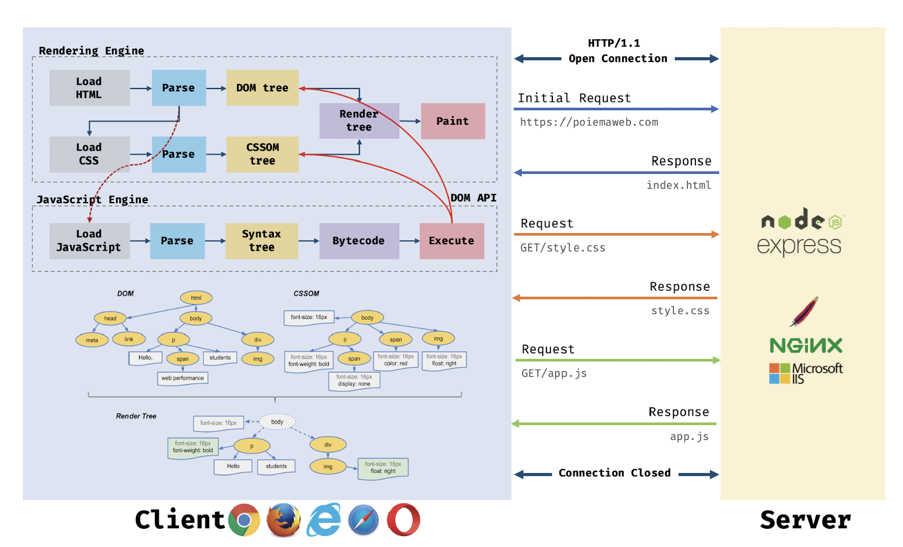
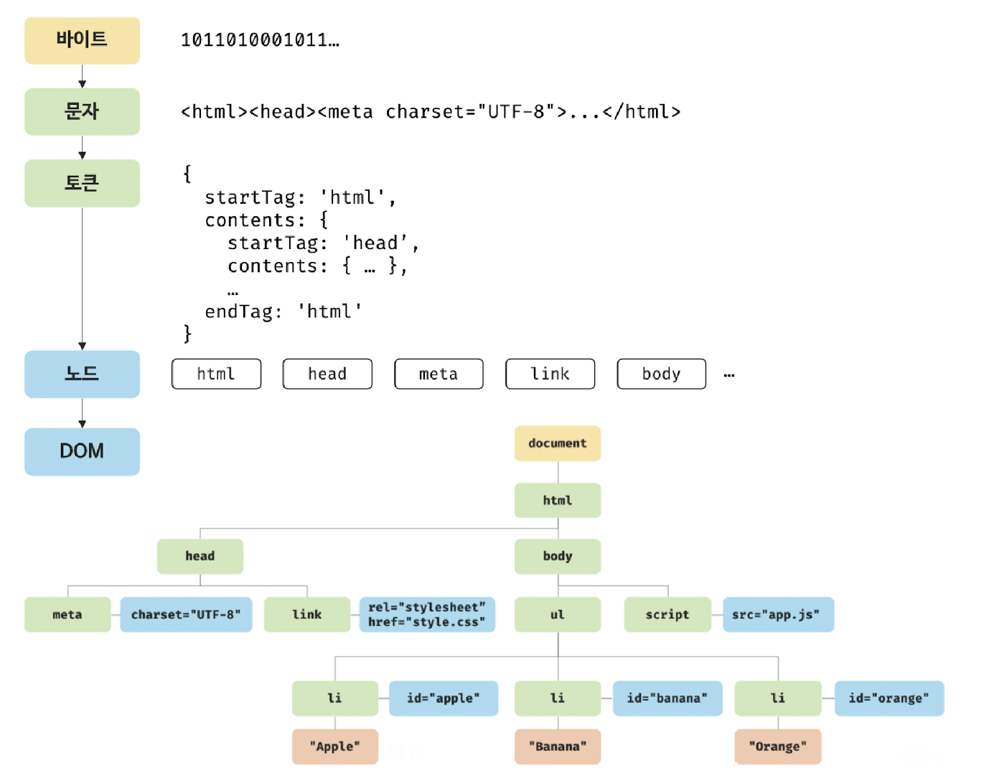
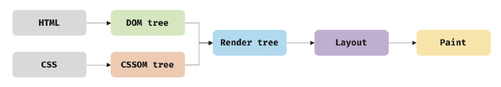
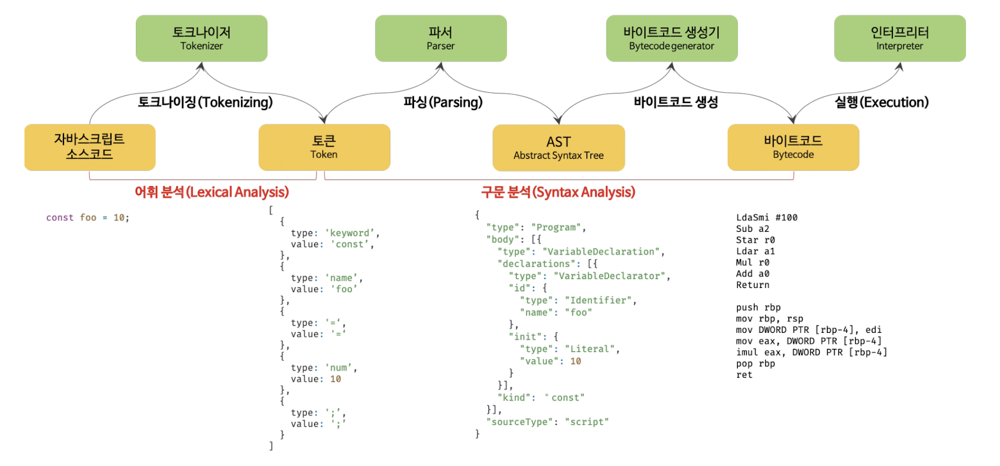
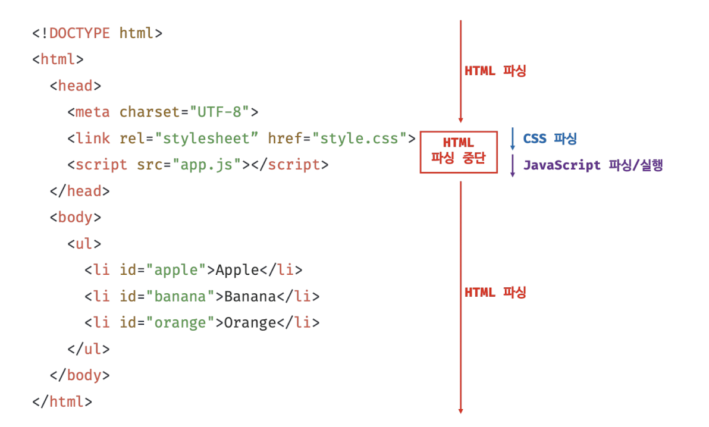

# 38. 브라우저 렌더링 과정

- 2024.8.4

## 🏷 브라우저 렌더링 과정

```
- 자바스크립트 런타임 환경인 Node.js의 등장으로 범용 개발 언어가 됨
- 파싱: 프로그래밍 언어의 문법에 맞게 작성된 문서롤 실행하기 위해 => 문자열을 토큰을 분해 => 토큰에 문법적 의미와 구조 반영 => 트리 구조의 자료구조 생성
- 렌더링: HTML, CSS, 자바스크립트로 작성된 문서를 파싱하여 브라우저에 시각적으로 출력
```



#### 브라우저 렌더링 과정

1. 렌더링에 필요한 리소스 요청, 서버로부터 응답 받음<br />
2. 응답된 HTML, CSS 파싱, DOM과 CSSOM 생성 => 렌더 트리 생성<br />
3. 응답된 자바스크립트 파싱, AST 생성, 바이트 코드로 변환하여 실행<br />
4. 렌더 트리를 기반으로 HTML 요소의 레이아웃 계산, 브라우저 화면에 HTML 요소 표시

<br />

## 🏷 요청과 응답

```
- 브라우저의 핵심 기능: 리소스를 서버로부터 응답받아 브라우저에 시각적으로 렌더링하는 것
- 요청과 응답은 개발자 도구의 Network 패널에서 확인 가능
- 외부 리소스를 로드하는 태그를 만나면 HTML 파싱을 잠시 중단하고 해당 리소스 파일 요청
```

#### 브라우저 요청 순서

1. 브라우저 주소창에 https://naver.com을 입력<br />
2. 루트 요청이 naver.com 서버로 전송<br />
3. 서버는 루트 요청에 대해 암묵적으로 index.html 응답 => 즉, naver.com과 naver.com/index.html은 동일한 요청<br />
4. index.html이 아닌 다른 정적 파일을 서버에 요청하려면 => 정적 파일의 경로 + 파일 이름 기술

<br />

## 🏷 HTTP 1.1과 HTTP 2.0

```
- HTTP: HyperText Transfer Protocol
- 웹에서 브라우저와 서버가 통신하기 위한 프로토콜
- HTTP/1.1: 커넥션 당 하나의 요청과 응답만 처리 => 외부 리소스 요청이 개별적으로 전송되고 응답 또한 개별적으로 전송
- HTTP/2: 커넥션 당 다중 요청/응답 가능, 1.1에 비해 약 50% 정도 빠름
```

<br />

## 🏷 HTML 파싱과 DOM 생성

```
- HTML 문서를 렌더링하려면 브라우저가 이해할 수 있는 자료구조 DOM (Document Object Modal)으로 변환하여 저장해야함
- 즉, DOM은 HTML 문서를 파싱한 결과물
- 파싱 과정: 바이트 -> 문자 -> 토큰 -> 노드 -> 결과 생성
```



<br />

## 🏷 CSS 파싱과 CSSOM 생성

```
- css 파일을 서버에 요청하여 로드한 CSS를 HTML과 동일한 파싱 과정을 거쳐 CSSOM 생성
```

<br />

## 🏷 렌더 트리 생성

```
- 렌더링 엔진은 서버로부터 응답된 HTML과 CSS를 파싱하여 DOM, CSSOM 생성
- DOM과 CSSOM은 렌더링을 위해 "렌더 트리"로 결합
- 브라우저 화면에 렌더링되는 노드만으로 구성
- 완성된 트리는 브라우저 화면에 픽셀을 렌더링하는 "페인팅 처리"에 입력
```



<br />

## 🏷 자바스크립트 파싱과 실행

```
- HTML 문서를 파싱한 결과물로 DOM API 제공
- DOM API => 이미 생성된 DOM을 동적으로 조작
- 자바스크립트 파싱과 실행 종료 => 렌더링 엔진으로 다시 제어권 넘기기 => HTML 파싱이 중단된 시점부터 다시 파싱 수행 => DOM 생성 재개
- 자바스크립트 엔진은 자바스크립트 코드를 파싱하여 "저수준 언어"로 변환
- 자바스크립트를 해석하여 AST(추상적 구문 트리)를 생성
- 이 AST를 기반으로 인터프리터가 실행할 수 있는 "바이트 코드"를 생성하여 실행
```



#### 토크나이징 tokenizing

> 소스코드를 어휘 분석하여 문법적 의미를 갖는 토큰들로 분해

#### 바이트코드 생성과 실행

> AST는 바이트코드로 변환되고 인터프리터에 의해 실행됨

<br />

## 🏷 리플로우와 리페인트

```
- DOM API 사용 시 DOM이나 CSSOM이 변경됨
- 이는 다시 렌더 트리로 결합되고, 레이아웃과 페인트 과정을 거쳐 화면에 재렌더링됨 => 리플로우/리페인트
- 리플로우(reflow): 레이아웃 계산을 다시 하는 것, 레이아웃에 영향을 주는 변경이 발생한 경우에 한하여 실행
- 리페인트(repaint): 재결합된 렌더 트리를 기반으로 다시 페인트 하는 것
- 리플로우와 리페인트는 동시 실행하지 않음, 레이아웃에 변동이 있어야 리플로우 실행
```

<br />

## 🏷 자바스크립트 파싱에 의한 HTML 파싱 중단



<br />

## 🏷 script 태그의 async/defer 어트리뷰트

```
- 자바스크립트 파싱에 의한 DOM 생성 문제 해결을 위해 => script 태그에 async, defer 어트리뷰트 추가
- src 어트리뷰트를 통해 외부 자바스크립트 파일을 로드하는 경우에만 사용
- 예) <script async src="..."></script>
- async과 defer 사용 시 HTML 파싱과 외부 파일의 로드가 비동기적으로 동시에 실행
```

#### async 어트리뷰트


```
- HTML 파싱과 외부 자바스크립트 파일의 로드가 비동기적으로 동시에 실행
- 단, 자바스크립트 파싱과 실행은 파일의 로드가 완료된 직후 진행되며 HTML 파싱 중단됨
- async 어트리뷰트 사용 시 script 태그의 순서와는 상관없이 먼저 로드된 스크립트가 먼저 실행
- 순서 보장이 필요한 경우 async 어트리뷰트 대신 defer 어트리뷰트 사용
```

#### defer 어트리뷰트


```
- async 어트리뷰트와 마찬가지로 비동기적으로 동시 실행
- 단, 자바스크립트의 파싱과 실행은 HTML 파싱이 완료된 직후 진행
```
