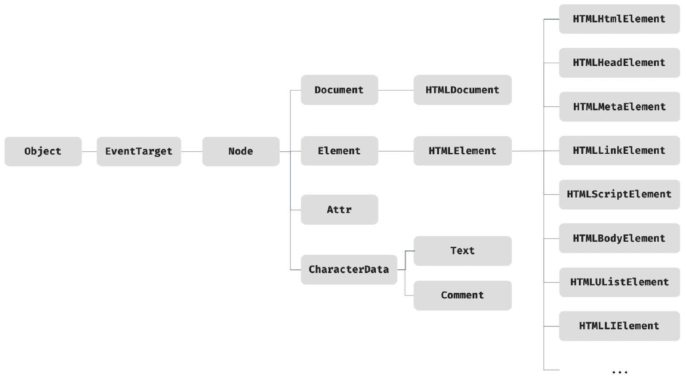

# 39. DOM

- 2024.8.5

## 🏷 DOM이란

```
- DOM (Document Object Model)
- HTML 문서의 계층적 구조와 정보 표현
- 프로퍼티와 메서드를 제공하는 트리 자료구조
```

<br />

## 🏷 노드

### 1.1 HTML 요소와 노드 객체

```
- HTML 요소: HTML 문서를 구성하는 개별적인 요소
- <시작태그 어트리뷰트="어트리뷰트 값">콘텐츠</종료태그>
- 렌더링 엔진에 의해 파싱되어 DOM을 구성하는 요소 노드 객체로 변환
- HTML 요소는 중첩 관계 => 텍스트 뿐만 아니라 다른 HTML 요소도 사용 가능
- HTML은 요소를 객체화하여 모든 노드 객체들을 트리 자료 구조로 구성
```

#### 트리 자료 구조

> 부모 노드와 자식 구조로 구성되어 노드 간의 계층 구조를 표현하는 "비선형 자료구조"

### 1.2 노드 객체의 타입

#### 문서 노드 (document node)

```
- DOM 트리의 최상위에 존재하는 루트 노드, document 객체를 표시
- window.document 또는 document로 참조 가능
- HTML 문서 당 document 객체는 유일
- DOM 트리의 노드들이 접근하기 위한 진입점 역할 담당
```

#### 요소 노드 (element node)

```
- HTML 요소를 가리키는 객체, 문서 구조 표현
- 요소 간 중첩에 의해 부자 관계 생성, 부자 관계를 통해 정보 구조화
```

#### 어트리뷰트 노드 (attribute node)

```
- HTML 요소의 어트리뷰트를 가리키는 객체
- 어트리뷰트가 지정된 HTML 요소의 요소 노드와 연결
- 어트리뷰트 노드는 부모 노드 없음, 요소 노드에 연결되어 있으나 형제는 아님
- 어트리뷰트 노드 참조 및 변경 시 요소 노드에 먼저 접근
```

#### 텍스트 노드 (text node)

```
- HTML 요소의 텍스트를 가리키는 객체, 문서 정보 표현
- 요소 노드의 자식 노드, 자식을 가질 수 없는 리프 노드
- 텍스트 노드 접근 시 요소 노드에 먼저 접근
```

### 1.3 노드 객체의 상속 구조

```
- 노드 객체 => 표준 빌트인 객체가 아닌 브라우저 환경에서 제공하는 호스트 객체
```

- 상속 구조



```
- 모든 노드 객체는 Object, EventTarget, Node 인터페이스 상속
- 문서 노드는 Document, HTMLDocument 인터페이스 상속
- 어트리뷰트 노드는 Attr, 텍스트 노드는 CharacterData 인터페이스 상속
- 어떤 요소를 객체화한 노드 객체는 요소의 HTMLElement, HTMLElement, Element, Node, EventTarget, Object의 프로토타입에 바인딩 => 요소 노드 객체는 프로토타입 체인에 있는 모든 프로퍼티나 메서드 상속
```

- 예시

| input 요소 노드 객체의 특성                                | 프로토타입을 제공하는 객체 |
| ---------------------------------------------------------- | -------------------------- |
| 객체                                                       | Object                     |
| 이벤트를 발생시키는 객체                                   | EventTarget                |
| 트리 자료구조의 노드 객체                                  | Node                       |
| 브라우저가 렌더링할 수 있는 웹 문서의 요소를 표현하는 객체 | Element                    |
| 웹 문서의 요소 중 HTML 요소를 표현하는 객체                | HTMLElement                |
| HTML 요소 중에서 input 요소를 표현하는 객체                | HTMLInputElement           |

```
- HTML 요소가 갖는 공통적인 기능은 HTMLElement 인터페이스가 제공
- 공통된 공통된 기능의 프로토타입 체인 - 고유 기능의 프로토타입 체인 순서대로 상속 구조 구축
- DOM은 HTML 문서의 계층적 구조와 정보 표시, 노드 타입에 따라 필요한 기능을 표시하는 DOM API 제공
- DOM API를 통해 HTML의 구조나 내용 또는 스타일 등을 동적으로 조작 가능
```

<br />

## 🏷 요소 노드 취득

### 2.1 id를 이용한 요소 노드 취득

> Document.prototype.getElementById

```
- 인수로 전달한 id 값을 갖는 요소 노드를 탐색하여 반환 (없는 경우 null 반환)
- id 값은 HTML 문서 내에서 유일한 값
- getElementById 메서드는 언제나 하나의 요소 노드 반환
- id 값과 동일한 이름의 전역 변수가 이미 선언 되어있을 때 => 전역 변수에 노드 객체가 재할당되지 않음
```

### 2.2 태그 이름을 이용한 요소 노드 취득

> Document.prototype.getElementsByTagName

```
- 인수로 전달한 태그 이름을 갖는 모든 요소 노드를 탐색하여 반환
- 모든 요소 노드 탐색 시 인수로 '*' 전달
- Document.getElementsByTagName은 DOM 전체에서 요소 노드 탐색 vs Element.getElementByTagName은 특정 요소 노드의 자손 노드에서 탐색
```

### 2.3 class를 이용한 요소 노드 취득

> Document.prototype.getElementsByClassName

```
- 인수로 전달한 class 값을 갖는 모든 요소 노드를 탐색하여 반환
- 공백으로 구분한 문자열로 여러 개의 class 지정 가능 (예: 'fruit apple id)
- Document.getElementsByClassName DOM 전체에서 요소 노드 탐색 vs Element.getElementsByClassName 특정 요소 노드의 자손 노드에서 탐색
```

### 2.4 CSS 선택지를 이용한 요소 노드 취득

#### Document.prototype.querySelector

```
- CSS 선택자: 스타일을 적용하고자 하는 HTML 요소를 특정할 때 사용하는 문법
```

| 구분                                        | 반환 값                |
| ------------------------------------------- | ---------------------- |
| 인수를 만족시키는 요소 노드가 여러개인 경우 | 첫번째 요소 노드 반환  |
| 인수를 만족시키는 요소 노드가 없는 경우     | null 반환              |
| 인수가 문법에 맞지 않는 경우                | DOMException 에러 발생 |

#### Document.prototype.querySelectorAll

```
- 인수로 전달한 CSS 선택자를 만족시키는 모든 요소 노드 반환
- HTML의 모든 요소 노드를 취득하려면 인수로 '*' 전달
```

| 구분                                    | 반환 값                |
| --------------------------------------- | ---------------------- |
| 인수를 만족시키는 요소 노드가 있는 경우 | NodeList 반환          |
| 인수를 만족시키는 요소 노드가 없는 경우 | 빈 NodeList 반환       |
| 인수가 문법에 맞지 않는 경우            | DOMException 에러 발생 |

### 2.5 특정 노드를 취득할 수 있는지 확인

```
- Element.prototype.matches 메서드 => 인수를 통해 특정 노드를 취득할 수 있는지 여부 반환
- 이벤트 위임을 사용할 때 유용
```

### 2.6 HTMLCollection과 NodeList

```
- DOM API가 여러 개의 결과값을 반환하기 위한 DOM 컬렉션 객체
- for...of문이나 스프레드 문법으로 순회 가능
- 노드 객체의 상태 변화를 실시간으로 반영 가능
```

#### HTMLCollection

```
- 노드 객체의 상태 변화를 실시간으로 반영하는 DOM 컬렉션 객체
- 실시간으로 요소 제거 => 상태 변경 시 주의하기 => for문을 역방향으로 순회하는 방법으로 회피 가능
- 또는 while문으로 HTMLCollection 객체에 노드가 남아 있지 않을 때까지 무한 반복하는 방법으로 회피 가능
```

#### NodeList

```
- 실시간으로 노드 객체 상태 변경을 반영하지 않는 non-live 객체
- 그러나 HTMLCollection 객체와 같이 live 객체로 동작할 수 있으므로 주의 필요함
- 노드 객체의 상태 변경과 상관없이 안전하게 DOM 컬렉션을 사용하려면 => HTMLCollection이나 NodeList를 배열로 변환하여 사용하는 것을 권장
- 배열로 반환하면 고차함수를 사용할 수 있다는 장점이 있음
```

<br />

## 🏷 노드 탐색

```
- DOM 트리 상의 노드 탐색을 위한 트리 탐색 프로퍼티 제공
- 예) parentNode, previousSibling / nextElementSibling, children
- 노드 탐색 프로퍼티는 getter만 존재하는 읽기 전용 접근자 프로퍼티
```

### 3.1 공백 텍스트 노드

```
- HTML 문서에 스페이스 키, 탭 키, 엔터 키 등 입력 시 공백 문자 추가
- 노드 탐색 시 공백 문자가 생성산 공백 텍스트 노드에 주의
```

### 3.2 자식 노드 탐색

| 프로퍼티 | 설명 |
| --- | --- |
| Node.prototype.childNodes | 자식 노드를 모두 탐색하여 NodeList에 담아 반환 |
| Element.prototype.children | 자식 노드 중 요소 노드만 탐색하여 HTMLCollection에 담아 반환 |
| Node.prototype.firstChild | 첫번째 자식 노드 반환 |
| Node.prototype.lastChild | 마지막 자식 노드 반환 |
| Element.prototype.firstElementChild | 첫번째 자식 요소 노드 반환 |
| Element.prototype.lastElementChild | 마지막 자식 요소 노드 반환 |

### 3.3 자식 노드 존재 확인

```
- Node.prototype.hasChildNodes 메서드 사용
- 자식 노드 존재 시 true, 아닐 시 false 반환
- 자식 노드 중 텍스트 노드가 아닌 요소 노드가 존재하는지 확인 => children.length / Element의 childElementCount
```

### 3.4 요소 노드의 텍스트 노드 탐색

```
- 요소 노드의 텍스트 노드 = 요소 노드의 자식 노드
- firstChild 프로퍼티가 반환한 노드는 텍스트 노드이거나 요소 노드
```

### 3.5 부모 노드 탐색

```
- Node.prototype.parentNode 프로퍼티 사용
- 텍스트 노드는 리프 노드이므로 부모 노드가 텍스트 노드인 경우는 없음
```

### 3.6 형제 노드 탐색

| 프로퍼티 | 설명 |
| --- | --- |
| Node.prototype.previousSibling | 부모 노드 중 형제가 같은 노드 중 자신의 이전 형제 노드 탐색 |
| Node.prototype.nextSibiling | 부모 노드 중 형제가 같은 노드 중 자신의 다음 형제 노드 탐색 |
| Element.prototype.previousElementSibling | 부모 노드가 같은 형제 요소 노드 중에서 자신의 이전 형제 요소 탐색 |
| Element.prototype.nextElementSibling | 부모 노드가 같은 형제 요소 노드 중에서 자신의 다음 형제 요소 노드 탐색 |

<br />

## 🏷 노드 정보 취득

| 프로퍼티 | 설명 |
| --- | --- |
| Node.prototype.nodeType | 노드 타입을 나타내는 상수 반환<br />- 요소 노드 타입(1)<br />- 텍스트 노드 타입(3)<br />- 문서 노트 타입(9) |
| Node.prototype.nodeName | 노드 이름을 문자열로 반환<br>- 요소 노드: 태그 이름을 대문자로 반환<br />- 텍스트 노드: '#text' 반환<br />- 문자 노드: '#document' 반환 |

<br />

## 🏷 요소 노드의 텍스트 조작

### 5.1 nodeValue

```
- 노드 객체의 nodeValue 참조 시 노드 객체의 값 반환
- 텍스트 노드가 아닌 노드의 nodeValue 참조 시 null 반환
- 텍스트를 변경할 요소 노드 취득 => 취득한 요소 노드의 텍스트 노드 탐색 => 탐색한 노드의 nodeValue 프로퍼티를 사용하여 텍스트 노드의 값 변경
```

### 5.2 textContent

```
- Node.prototype.textContent 프로퍼티 => 접근자 프로퍼티, 요소 노드의 텍스트와 모든 자손 노드의 텍스트를 모두 취득하거나 변경
- textContent 프로퍼티에 문자열 할당 시 요소 노드의 모든 자식 노드가 제거되고 할당한 문자열이 텍스트로 추가
- 이떄 HTML 마크업도 문자열 그대로 인식
```

<br />

## 🏷 DOM 조작

```
- 새로운 노드를 생성하여 DOM에 추가 + 기존 노드 삭제 또는 교체
- DOM에 새로운 노드가 추가/삭제되면 리플로우와 리페인트 발생 => 성능에 영향미침
```

### 6.1 innerHTML

```
- Element.prototype.innerHTML 프로퍼티는 요소 노드의 HTML 마크업을 취득/변경
- 요소 노드의 컨텐츠 영역 내에 포함된 모든 HTML 마크업을 문자열로 반환
- textContent 프로퍼티는 HTML 마크업 무시하고 텍스트만 반환
- innerHTML 프로퍼티에 문자열 할당 시 할당한 문자열에 포함되어있는 HTML 마크업 파싱, 요소 노드의 자식 노드로 DOM에 반영
- 단점 1) 사용자로부터 입력받은 데이터를 그대로 innerHTML에 할당하는 것은 "XSS 공격에 취약"
- 단점 2) 새로운 요소 삽입 시 삽입될 위치 지정 불가
```

### 6.2 insertAdjacentHTML 메서드

```
- 기존 요소를 제거하지 않으면서 위치를 지정해 새로운 요소 삽입
- 두번째 인수로 전달한 HTML 마크업 문자열을 파싱하고 생성된 노드를 첫번째 인수로 전달한 위치에 삽입하여 DOM 반영
- innerHTML 프로퍼티보다 효율적이고 빠름
- 단, HTML 마크업 문자열을 파싱하므로 XSS 공격에 또한 취약함
```

### 6.3 노드 생성과 추가

#### 요소 노드 생성

> Document.prototype.createElement(tagName)

```
- 요소 노드 생성하여 반환, 매개변수에는 태그 이름을 나타내는 문자열일 인수로 전달
- 요소 노드 생성하지만 DOM에 추가하지는 않음
- createElement로 생성한 요소 노드는 자식 노드 없음, 따라서 텍스트 노드도 없음
```

#### 텍스트 노드 생성

> Document.prototype.createTextNode(text)

```
- 텍스트 노드를 생성하여 반환, 매개변수 text에는 텍스트 노드의 값으로 사용할 문자열을 인수로 전달
- createTextNode로 생성한 텍스트 노드는 자식 노드로 추가되지 않고 홀로 존재
```

#### 텍스트 노드를 요소 노드의 자식 노드로 추가

> Node.prototype.appendChild(childNode)

```
- 매개변수 childeNode에게 인수로 전달한 노드를 호출한 노드의 마지막 노드로 추가
- 요소 노드에 자식 노드가 하나도 없는 경우에는 textContent 프로퍼티를 사용하는 편이 좋음
```

#### 요소 노드를 DOM에 추가

```
- 이 과정에서 새롭게 생성된 요소 노드가 DOM에 추가 => 리플로우, 리페인트 실행
```

### 6.4 복수의 노드 생성과 추가

```
- DOM을 변경하는 것은 비용이 많이 드는 처리이므로 가급적 횟수를 줄이는 편이 유리
- => DocumentFragment 노드를 통해 해결 가능
- DocumentFragment: 문서, 요소, 어트리뷰트, 텍스트 노드와 같은 노드 객체의 일종
- 부모 노드가 없어 기존 DOM과는 별도로 존재
- 기존 DOM과는 별도로 존재하므로 DocumentFragment 노드에 자식 노드를 추가해도 기존 DOM에는 어떠한 변경도 발생하지 않음
- Document.prototype.createDocumentFragment => 비어있는 DocumentFragment 노드를 생성하여 반환
```

### 6.5 노드 삽입

#### 마지막 노드로 추가

```
- Node.prototype.appendChild 메서드 활용
```

#### 지정한 위치에 노드 삽입

> Node.prototype.insertBefore(newNode, childNode)

```
- 첫번째 인수로 전달받은 노드를 두번째 인수로 전달받은 노드 앞에 삽입
- 두번째 인수는 반드시 메서드를 호출한 노드의 자식 노드 => DOMException 에러 발생
- 두번째 인수가 null이라면 메서드를 호출한 노드의 마지막 자식 노드로 추가 (appendChild와 동일한 동작)
```

### 6.6 노드 이동

```
- DOM에 이미 존재하는 노드를 appendChild, insertBefore 메서드를 사용하여 DOM에 다시 추가하면 노드가 이동함
```

### 6.7 노드 복사

> Node.prototype.cloneNode([deep: true | false])

```
- 노드의 사본을 생성하여 반환
- 매개변수 deep이 true라면 깊은 복사하여 모든 자손 노드가 포함된 사본 생성
- 매개변수 deep이 false라면 얕은 복사하여 자신만 복사하하여 사본 생성
```

### 6.8 노드 교체

> Node.prototype.replaceChild(newChild, oldChild)

```
- 자신을 호출한 노드의 자식 노드를 다른 노드로 교체
- 첫번째 매개변수에는 교체할 새로운 인수를, 두번째 매개변수에는 이미 존재하는 교체될 노드를 인수로 전달
- 인수로 전달한 노드는 메서드를 호출한 노드의 자식 노드
```

### 6.9 노드 삭제

> Node.prototype.removeChild(child)

```
- child 매개변수에 인수로 전달한 노드를 DOM에서 삭제
- 인수로 전달한 노드는 메서드를 호출한 노드의 자식노드여야함
```

<br />

## 🏷 어트리뷰트

### 7.1 어트리뷰트 노드와 attributes 프로퍼티

```
- HTML 어트리뷰트는 HTML 요소의 시작태그에 어트리뷰트명="어트리뷰트값" 형식으로 정의
- 모든 어트리뷰트 노드의 참조는 NameNodeMap 객체에 담겨 요소 노드의 attributes 프로퍼티에 저장
```

### 7.2 HTML 어트리뷰트 조작

```
- Element.prototype.getAttribute/setAttribute 메서드 사용시 요소 노드에서 직접 HTML 어트리뷰트 값을 취득하거나 변경 가능
- Element.prototype.hasAttribute(attributeName)으로 특정 어트리뷰트의 존재 여부 확인
- Element.prototype.removeAttribute(attributeName)으로 HTML 어트리뷰트 삭제
```

### 7.3 HTML 어트리뷰트 vs DOM 프로퍼티

```
- 요소 노드는 초기 상태와 최신 상태 관리
- 요소 노드의 초기 상태는 어트리뷰트 노드가 관리, 최신 상태는 DOM 프로퍼티가 관리
```

#### 어트리뷰트 노드

```
- HTML 어트리뷰트로 지정한 HTML 요소의 초기 상태는 어트리뷰트 노드에서 관리
- 초기 상태 값을 취득/변경하려면 getAttribute/setAttribute 메서드 사용
```

#### DOM 프로퍼티

```
- HTML 어트리뷰트에 대응하는 요소 노드의 DOM 프로퍼티가 최신 상태를 관리
- DOM 프로퍼티는 사용자 입력에 대한 상태 변화에 반응하여 최신 상태 유지
```

#### HTML 어트리뷰트와 DOM 프로퍼티의 대응 관계

```
- HTML 어트리뷰트 이름과 동일한 DOM 프로퍼티와 1:1로 대응
- 단, 반드시 언제나 1:1로 대응하는 것은 아님
```

#### DOM 프로퍼티 값의 타입

```
- getAttribute 메서드로 취득한 어트리뷰트 값은 항상 문자열
- 그러나 DOM 프로퍼티로 취득한 최신 상태 값은 문자열이 아닐 수도 있음
```

### 7.4 data 어트리뷰트와 dataset 프로퍼티

```
- 사용자 정의 어트리뷰트와 자바스크립트 간에 데이터 교환 가능
- data 어트리뷰트는 data- 접두사 사용 (예: data-user-id)
- dataset 프로퍼티는 DOMStringMap 객체 반환
- DOMStringMap: HTML 요소의 모든 data 어트리뷰트의 정보 제공
```

<br />

## 🏷 스타일

### 8.1 인라인 스타일 조작

```
- HTMLElement.prototype.style 프로퍼티는 접근자 프로퍼티로서 요소 노드의 인라인 스타일을 취득/추가/변경
- style 프로퍼티 참조 시 CSSStyleDeclaration 타입의 객체 반환
- CSSStyleDeclaration: 다양한 CSS에 대응하는 프로퍼티 보유
```

### 8.2 클래스 조작

#### className

```
- Element.prototype.className 프로퍼티: 접근자 프로퍼티, HTML 요소의 class 어트리뷰트 값을 취득/변경
- 요소 노드의 className 프로퍼티에 문자열 할당 시 class 어트리뷰트 값을 할당한 문자열로 변경
```

#### classList

```
- Element.prototype.classList 프로퍼티: class 어트리뷰트의 정보를 담은 DOMTokenList 객체 반환
- DOMTokenList 객체는 다음의 유용한 메서드 제공
	- add(...className): 인수를 class 어트리뷰트 값으로 추가
	- remove(...className): 인수와 일치하는 클래스를 class 어트리뷰트에서 삭제
	- item(index): 인수(index)에 해당하는 클래스를 class 어트리뷰트에서 반환
	- contains(className): 인수와 일치하는 클래스에 class 어트리뷰트에 포함되어 있는지 확인
	- replace(oldClassName, newClassName): class 어트리뷰트에서 첫번째 인수를 두번째 인수로 변경
	- toggle(className[, force]): 인수와 일치하는 클래스가 존재하면 제거, 아니라면 추가
```

### 8.3 요소에 적용되어 있는 CSS 스타일 참조

```
- HTML 요소에 적용된 모든 CSS 스타일 참조 시 getComputedStyle 메서드 사용
- 첫번째 인수로 전달한 요소 노드의 스타일을 CSSStyleDeclaration 객체에 담아 반환
- 평가된 스타일: 요소 노드에 적용되어있는 모든 스타일이 조합되어 최종적으로 적용된 스타일
```

<br />

## 🏷 DOM 표준

```
- W3C와 WHATWG에 의해 공통된 표준 생성
- 두 단체가 다른 결과물을 내기 시작 => 2018년 4월부터 WHATWG의 단일 표준 채택
```
